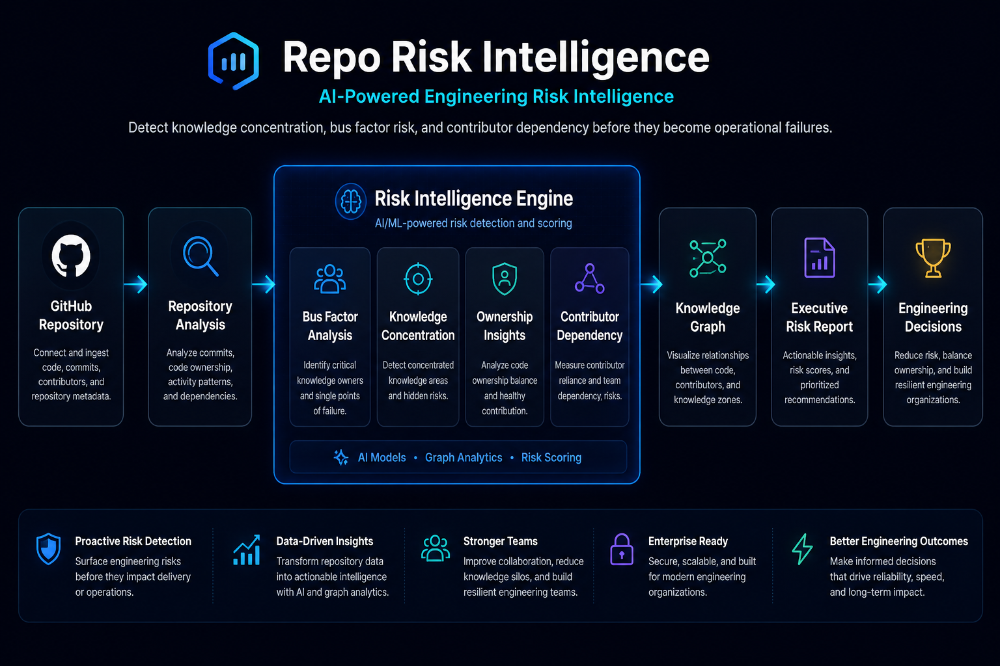
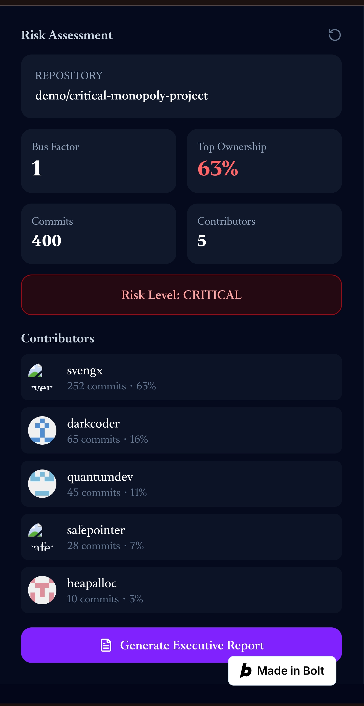
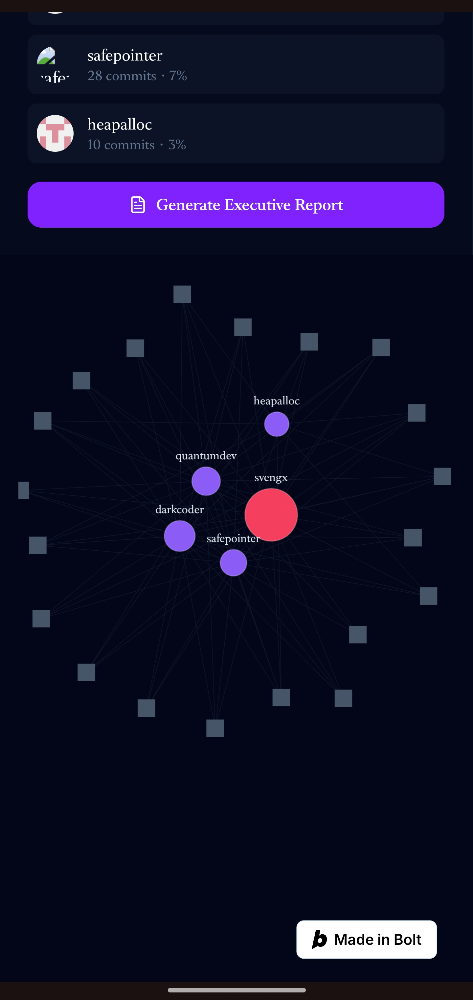

# Repo Risk Intelligence

<p align="center">
  
</p>

<p align="center">
  <strong>AI-Powered Engineering Risk Intelligence for GitHub Repositories</strong><br>
  Detect knowledge concentration, bus factor risk, ownership imbalance, and contributor dependency before they become engineering bottlenecks.
</p>

<p align="center">
  
  
  
  
  
  
</p>

---

## Executive Product Overview

**Repo Risk Intelligence** is a modern engineering intelligence product that helps teams understand hidden operational risk inside GitHub repositories.

Most dashboards show activity.

This product shows **risk**.

It analyzes repository structure, contributor activity, ownership concentration, and knowledge distribution to answer the questions engineering leaders actually care about:

- Which modules depend on one or two critical people?
- Where is knowledge concentrated?
- Which contributors are carrying too much ownership?
- How risky is this repository if a key engineer leaves?
- What should leadership do next?

The product turns repository data into a clear visual risk story through a landing experience, a risk dashboard, a knowledge graph, and an executive report.

---

## Problem Statement

Engineering organizations often discover operational risk too late.

A repository can look healthy on the surface while hiding serious structural risk underneath:

- one engineer owns a large part of the codebase,
- knowledge about critical modules is concentrated in a small group,
- contributor handoffs are weak,
- and leadership has no easy way to measure bus factor or ownership imbalance.

Traditional repository analytics tools usually focus on activity metrics such as commits, stars, or pull requests. Those metrics are useful, but they do not answer the deeper question:

> **How resilient is this repository if one or more key contributors become unavailable?**

That gap is what Repo Risk Intelligence is designed to close.

---

## Demo

<p align="center">
  
</p>

---

## Enterprise Architecture Diagram

<p align="center">
  
</p>

The architecture focuses on a clear product workflow:

1. GitHub repository input
2. Repository analysis
3. Commit and contributor extraction
4. Risk Intelligence Engine
5. Knowledge graph
6. Executive risk report
7. Engineering decisions

This is a product architecture, not an infrastructure diagram. It is designed to communicate how the product works in under 10 seconds.

---

## Dashboard Walkthrough

<p align="center">
  
</p>

The dashboard is the main working surface of the application.

It presents repository risk in a way that is easy to scan:

- top-level risk indicators,
- contributor concentration,
- bus factor signals,
- ownership patterns,
- and actionable visual summaries.

### What the dashboard answers

- Is this repository healthy?
- Where are the highest-risk areas?
- Which contributor patterns are concerning?
- What should leadership look at first?

---

## Knowledge Graph Explanation

<p align="center">
  
</p>

The knowledge graph is one of the most important differentiators in the product.

Rather than only showing counts or charts, it helps surface relationships between:

- contributors,
- files,
- modules,
- ownership clusters,
- and risk hotspots.

### Why the knowledge graph matters

Repository risk is often relational. A file may appear harmless until you see that:

- only one person works on it,
- it is tied to critical delivery paths,
- and no one else has meaningful context.

The graph makes those relationships easier to understand.

---

## Executive Report Walkthrough

The executive report is the leadership-facing output of the product.

It converts repository analysis into a concise risk narrative for technical decision-makers.

### Report Content

- Risk score / risk grade
- Bus factor assessment
- Ownership concentration
- Contributor impact analysis
- Executive summary
- Leadership recommendations

<p align="center">
  <a href="assets/screenshots/executive-report.pdf">Open the Executive Risk Report (PDF)</a>
</p>

### Why this matters

Engineers need detail. Leaders need clarity.

The executive report bridges both.

It is designed so a CTO, engineering manager, or founder can quickly understand:

- what the risk is,
- why it matters,
- and what to do next.

---

## Core Features

- Bus Factor Analysis
- Knowledge Concentration Detection
- Ownership Insights
- Contributor Dependency Analysis
- Interactive Knowledge Graph
- AI Executive Reports
- Engineering Decision Support

---

## Product Workflow

```text
GitHub Repository
        │
        ▼
Repository Analysis
        │
        ▼
Commit & Contributor Extraction
        │
        ▼
Risk Intelligence Engine
   ├── Bus Factor Analysis
   ├── Knowledge Concentration
   ├── Ownership Insights
   └── Contributor Dependency
        │
        ▼
Knowledge Graph
        │
        ▼
Executive Risk Report
        │
        ▼
Engineering Decisions
```

---

## Technical Architecture

Repo Risk Intelligence is built as a modern front-end product that combines repository data, analytics logic, and visual presentation.

### High-level layers

- **Presentation Layer** — dashboard, landing page, screenshots, report visuals
- **Analysis Layer** — risk scoring, contributor analysis, ownership mapping
- **Visualization Layer** — knowledge graph and executive visuals
- **Integration Layer** — GitHub repository data and repository metadata

### Design goals

- fast to scan,
- easy to explain,
- enterprise-ready appearance,
- modular visuals,
- and clear decision support.

### What is intentionally not claimed

This repository does **not** present a public API, external multi-tenant backend, or enterprise infrastructure claims unless explicitly shown in the product or codebase.

---

## Technology Stack

| Layer | Technology |
|------|------------|
| UI | React |
| Language | TypeScript |
| Build Tool | Vite |
| Data Source | GitHub Repository Data |
| Visualization | Graph-based UI |
| Reporting | AI-generated Executive Reports |
| Deployment | Bolt.new hosted deployment |
| Branding | Figma-designed assets |

---

## Installation Guide

> **Note:** This project is currently presented as a live hosted product and portfolio repository.
> If local setup is added later, this section should be updated with exact commands from the actual codebase.

### Expected local setup pattern

```bash
git clone <repository-url>
cd Repo-Risk-Intelligence
npm install
npm run dev
```

Use the exact package manager and scripts that exist in the repository. Do not guess.

---

## Local Development

When local development is supported, the recommended workflow should be:

1. Clone the repository.
2. Install dependencies.
3. Start the development server.
4. Open the local app in a browser.
5. Review repository analysis flows.
6. Verify dashboard, graph, and report rendering.

If any of these steps differ in the final implementation, this section should be updated to match reality.

---

## API Design

At the current stage, there is no public API documented in this repository.

That is okay.

A premium README should not invent endpoints or claim API coverage that does not exist.

### Future API direction

If an API is added later, document:

- endpoint names,
- request/response formats,
- authentication method,
- rate limits,
- and example payloads.

---

## Engineering Decisions

### 1) Product-first design

The app is designed to communicate risk clearly, not overwhelm the user with raw repository data.

### 2) Enterprise visual language

The dashboard, banner, architecture diagram, and screenshots follow a premium dark SaaS aesthetic.

### 3) Decision support over activity metrics

The product focuses on engineering risk, ownership, and resilience rather than superficial repository counts.

### 4) Readability over complexity

Every visual element is optimized for fast understanding in a GitHub README.

### 5) Honest documentation

The repository documents what exists today and separates future capabilities into the roadmap.

### 6) Portfolio alignment

This is not just a product. It is a strategic portfolio artifact for demonstrating AI-native product thinking.

---

## Recruiter-Focused Highlights

This repository is useful if you want to demonstrate:

- enterprise SaaS thinking,
- product strategy,
- engineering risk analysis,
- AI-native workflow design,
- visual communication,
- and the ability to ship a polished public product.

### What a recruiter can infer quickly

- You can build a real product.
- You can think about engineering systems.
- You can design for clarity.
- You can present technical work professionally.
- You understand how to make a GitHub portfolio feel like a product page.

### What a hiring manager may notice

- The product solves a real operational problem.
- The visuals are consistent and enterprise-grade.
- The repository shows end-to-end ownership.
- The documentation is structured and intentional.
- The project is good enough to discuss in interviews.

---

## Future Roadmap

### Planned enhancements

- Repository comparison
- Organization-wide analytics
- Historical trend analysis
- GitHub App integration
- AI risk scoring refinement
- Predictive engineering analytics
- Slack and Microsoft Teams notifications
- Team health dashboard
- Multi-repository portfolio view

### Long-term vision

Move from a single-repository analysis tool to a broader engineering intelligence platform that helps teams understand organizational resilience across projects.

---

## Contributing Guide

Contributions are welcome.

If you want to improve the project:

1. Open an issue describing the problem or idea.
2. Keep pull requests focused and easy to review.
3. Update documentation when behavior changes.
4. Preserve the product’s enterprise visual language.
5. Avoid introducing unverified claims or undocumented features.

---

## License

Released under the **MIT License**.

See the `LICENSE` file for full details.

---

## Project Structure

```text
Repo-Risk-Intelligence/
├── README.md
├── LICENSE
├── ROADMAP.md
├── ARCHITECTURE.md
├── CONTRIBUTING.md
├── SECURITY.md
├── .github/
│   └── PULL_REQUEST_TEMPLATE.md
└── assets/
    ├── banner.png
    ├── architecture/
    │   └── architecture-diagram.png
    ├── demo/
    │   └── demo.gif
    └── screenshots/
        ├── dashboard.jpg
        ├── landing-page.jpg
        ├── knowledge-graph.jpg
        └── executive-report.pdf
```

---

## SEO Optimization

This README intentionally includes searchable terms that match the product’s purpose and audience:

- GitHub repository analytics
- engineering risk intelligence
- bus factor analysis
- contributor dependency
- knowledge concentration
- code ownership insights
- repository health
- engineering analytics
- AI-powered reporting
- knowledge graph visualization
- enterprise SaaS dashboard
- developer productivity analytics

---

## Closing Note

Repo Risk Intelligence is a public portfolio project built to demonstrate a simple but important idea:

> Engineering risk should be visible before it becomes a delivery problem.

This repository turns that idea into a polished, recruiter-grade product story.

<div align="center">

**Build resilient engineering organizations through AI-powered repository intelligence.**

</div>
