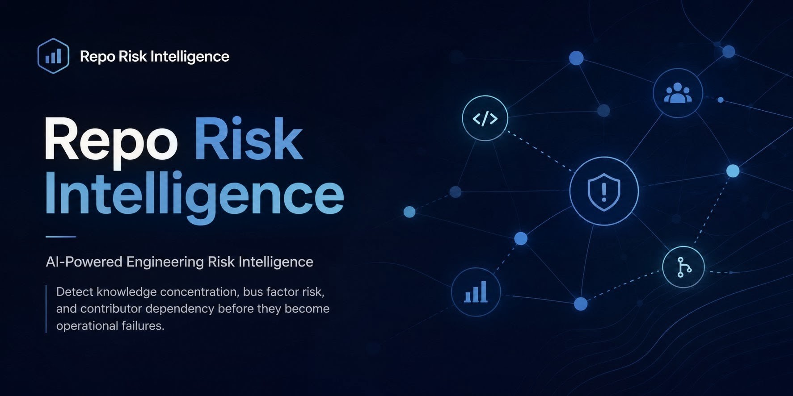

# Repo Risk Intelligence

<p align="center">
  
</p>

<p align="center">
  <strong>AI-Powered Engineering Risk Intelligence for GitHub Repositories</strong><br>
  Detect knowledge concentration, bus factor risk, ownership imbalance, and contributor dependency before they become engineering bottlenecks.
</p>

<p align="center">
  
  
  
  
  
  
</p>

---

## Table of Contents

- [Quick Start](#quick-start)
- [Executive Product Overview](#executive-product-overview)
- [Problem Statement](#problem-statement)
- [Live Demo](#live-demo)
- [Enterprise Architecture](#enterprise-architecture)
- [Dashboard Walkthrough](#dashboard-walkthrough)
- [Knowledge Graph Explanation](#knowledge-graph-explanation)
- [Executive Report Walkthrough](#executive-report-walkthrough)
- [Business Value](#business-value)
- [Core Features](#core-features)
- [Product Workflow](#product-workflow)
- [Technical Architecture](#technical-architecture)
- [Technology Stack](#technology-stack)
- [Project Status](#project-status)
- [Repository Topics](#repository-topics)
- [Future Roadmap](#future-roadmap)
- [Contributing](#contributing)
- [Support](#support)
- [License](#license)
- [Project Structure](#project-structure)

---

## Quick Start

Explore Repo Risk Intelligence in under two minutes.

1. Watch the demo GIF.
2. Review the architecture diagram.
3. Explore the dashboard screenshot.
4. Inspect the knowledge graph.
5. Open the executive report.
6. Review the roadmap.

---

## Executive Product Overview

While most repository analytics tools measure activity, **Repo Risk Intelligence reveals engineering risk**.

It analyzes repository ownership, contributor concentration, and knowledge distribution to help engineering leaders identify operational risk before it affects delivery.

The product turns repository data into a clear visual risk story through a landing experience, a risk dashboard, a knowledge graph, and an executive report.

---

## Problem Statement

Engineering teams often lack visibility into:

- Bus factor risk
- Knowledge concentration
- Contributor dependency
- Code ownership imbalance

A repository can look healthy on the surface while hiding serious structural risk underneath:

- one engineer owns a large part of the codebase,
- knowledge about critical modules is concentrated in a small group,
- contributor handoffs are weak,
- and leadership has no easy way to measure operational resilience.

Repo Risk Intelligence transforms repository metadata into decision-ready engineering intelligence.

---

## Live Demo

The product is deployed as a hosted experience:

**[Open the live demo](https://bus-factor-risk-anal-1g9y.bolt.host)**

<p align="center">
  
</p>

---

## Enterprise Architecture

<p align="center">
  
</p>

The architecture focuses on a clear product workflow:

1. GitHub repository input
2. Repository analysis
3. Commit and contributor extraction
4. Risk Intelligence Engine
5. Knowledge graph
6. Executive risk report
7. Engineering decisions

This is a product architecture, not an infrastructure diagram. It is designed to communicate how the product works in under 10 seconds.

---

## Dashboard Walkthrough

<p align="center">
  
</p>

The dashboard is the main working surface of the application.

It presents repository risk in a way that is easy to scan:

- top-level risk indicators
- contributor concentration
- bus factor signals
- ownership patterns
- actionable visual summaries

### Dashboard insights

- Repository health at a glance
- Highest-risk areas and modules
- Contributor patterns requiring attention
- Leadership action items

---

## Knowledge Graph Explanation

<p align="center">
  
</p>

The knowledge graph is one of the most important differentiators in the product.

Rather than only showing counts or charts, it helps surface relationships between:

- contributors
- files
- modules
- ownership clusters
- risk hotspots

### Why the knowledge graph matters

Repository risk is often relational. A file may appear harmless until you see that:

- only one person works on it,
- it is tied to critical delivery paths,
- and no one else has meaningful context.

The graph makes those relationships easier to understand.

---

## Executive Report Walkthrough

The executive report is the leadership-facing output of the product.

It converts repository analysis into a concise risk narrative for technical decision-makers.

### Report content

- Risk score / risk grade
- Bus factor assessment
- Ownership concentration
- Contributor impact analysis
- Executive summary
- Leadership recommendations

<p align="center">
  <a href="assets/screenshots/executive-report.pdf">Open the Executive Risk Report (PDF)</a>
</p>

### Why this matters

Engineers need detail. Leaders need clarity.

The executive report bridges both.

It is designed so a CTO, engineering manager, or founder can quickly understand:

- what the risk is,
- why it matters,
- and what to do next.

---

## Business Value

Repo Risk Intelligence helps engineering organizations:

- reduce key-person risk,
- improve ownership visibility,
- strengthen engineering resilience,
- support architectural decision-making,
- and surface hidden repository dependencies.

It is designed for:

- Engineering Managers
- Staff Engineers
- CTOs
- Platform Teams
- Open Source Maintainers

---

## Core Features

- Bus Factor Analysis
- Knowledge Concentration Detection
- Ownership Insights
- Contributor Dependency Analysis
- Interactive Knowledge Graph
- AI Executive Reports
- Engineering Decision Support

---

## Product Workflow

```text
GitHub Repository
        │
        ▼
Repository Analysis
        │
        ▼
Commit & Contributor Extraction
        │
        ▼
Risk Intelligence Engine
   ├── Bus Factor Analysis
   ├── Knowledge Concentration
   ├── Ownership Insights
   └── Contributor Dependency
        │
        ▼
Knowledge Graph
        │
        ▼
Executive Risk Report
        │
        ▼
Engineering Decisions
```

---

## Technical Architecture

Repo Risk Intelligence is built as a modern front-end product that combines repository data, analytics logic, and visual presentation.

### High-level layers

- **Presentation Layer** — dashboard, landing page, screenshots, report visuals
- **Analysis Layer** — risk scoring, contributor analysis, ownership mapping
- **Visualization Layer** — knowledge graph and executive visuals
- **Integration Layer** — GitHub repository data and repository metadata

### Design goals

- fast to scan
- easy to explain
- enterprise-ready appearance
- modular visuals
- clear decision support

### What is intentionally not claimed

This repository does **not** present a public API, external multi-tenant backend, or enterprise infrastructure claims unless explicitly shown in the product or codebase.

---

## Technology Stack

| Layer | Technology |
|------|------------|
| UI | React |
| Language | TypeScript |
| Build Tool | Vite |
| Data Source | GitHub Repository Data |
| Visualization | Graph-based UI |
| Reporting | AI-generated Executive Reports |
| Deployment | Bolt.new hosted deployment |
| Branding | Figma-designed assets |

---

## Project Status

- ✅ MVP complete
- ✅ Live demo available
- ✅ Architecture documented
- ✅ Product screenshots published
- ✅ Executive report generated
- ✅ Portfolio-ready public repository

### Current stage

Repo Risk Intelligence is in public portfolio / MVP showcase mode.

Future enhancements are tracked in the roadmap.

---

## Repository Topics

GitHub repository analytics • engineering risk intelligence • bus factor analysis • contributor dependency • knowledge concentration • code ownership insights • repository health • engineering analytics • AI-powered reporting • knowledge graph visualization • enterprise SaaS dashboard • developer productivity analytics

---

## Future Roadmap

### Planned enhancements

- Repository comparison
- Organization-wide analytics
- Historical trend analysis
- GitHub App integration
- AI risk scoring refinement
- Predictive engineering analytics
- Slack and Microsoft Teams notifications
- Team health dashboard
- Multi-repository portfolio view

### Long-term vision

Move from a single-repository analysis tool to a broader engineering intelligence platform that helps teams understand organizational resilience across projects.

---

## Contributing

Contributions are welcome.

If you want to improve the project:

1. Open an issue describing the problem or idea.
2. Keep pull requests focused and easy to review.
3. Update documentation when behavior changes.
4. Preserve the product’s enterprise visual language.
5. Avoid introducing unverified claims or undocumented features.

---

## Support

Questions, ideas, bug reports, and feature requests are welcome.

Please open a GitHub Issue.

---

## License

Released under the **MIT License**.

See the `LICENSE` file for full details.

---

## Project Structure

```text
Repo-Risk-Intelligence/
├── README.md
├── banner.png
├── LICENSE
├── ROADMAP.md
├── ARCHITECTURE.md
├── CONTRIBUTING.md
├── SECURITY.md
├── .github/
│   └── PULL_REQUEST_TEMPLATE.md
└── assets/
    └── screenshots/
        ├── architecture-diagram.png
        ├── dashboard.jpg
        ├── demo.gif
        ├── executive-report.pdf
        ├── knowledge-graph.jpg
        └── landing-page.jpg
```

---

## Closing Note

Repo Risk Intelligence demonstrates a critical principle:

> Engineering risk must be visible before it becomes a delivery problem.

This repository turns that principle into a polished, recruiter-grade product story.

<div align="center">

**Build resilient engineering organizations through AI-powered repository intelligence.**

</div>
